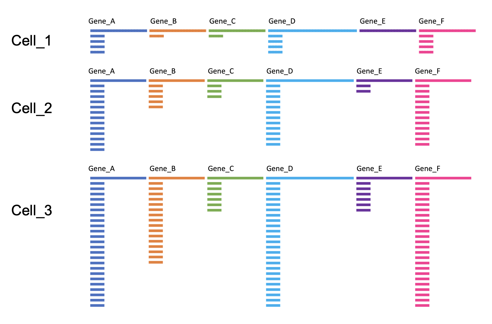
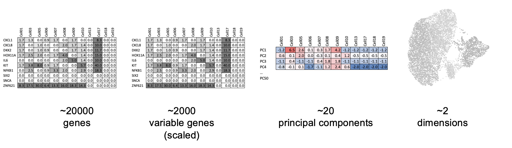
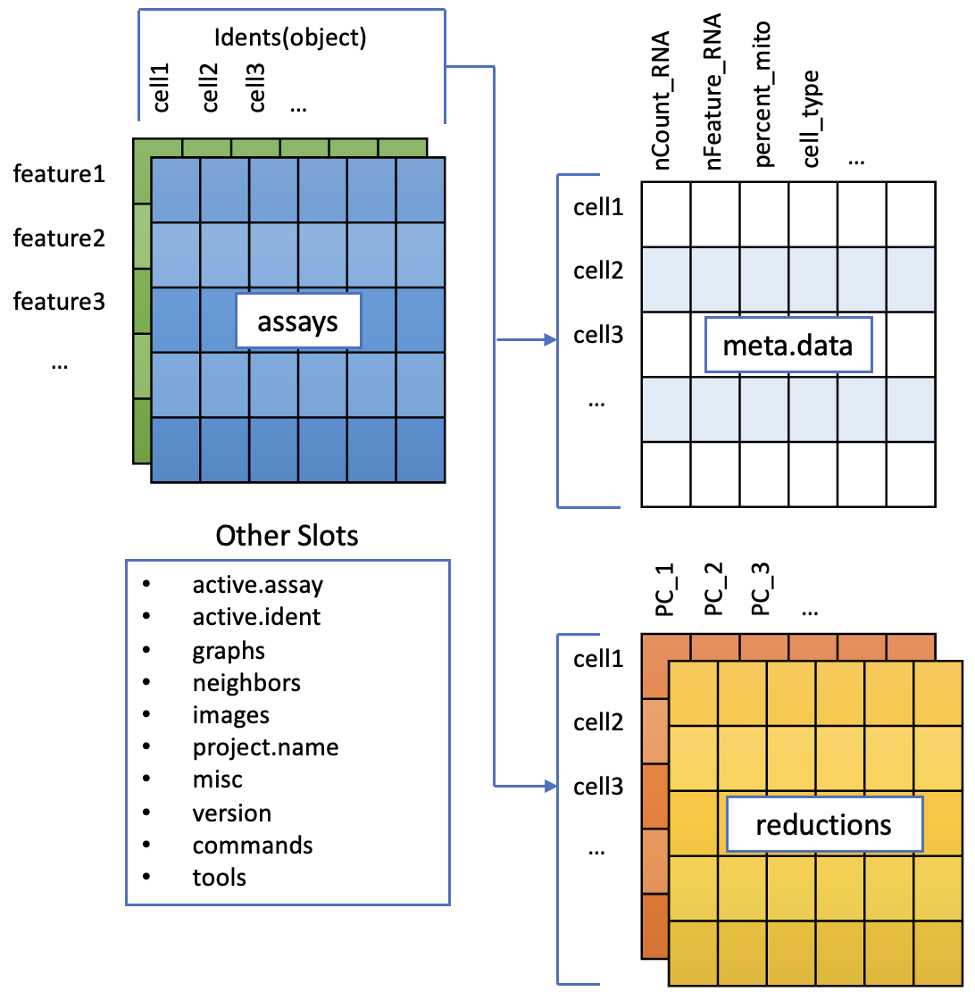

# (PART) Seurat Preprocessing {-} 

This workshop follows the introductory [Guided Clustering Tutorial](https://satijalab.org/seurat/articles/pbmc3k_tutorial.html) tutorial from Seurat. 

We will be jumping between that page - for the original content, and here - for extra tips, tricks and challenges. 


<!-- Generate the same objects as the Seurat Tutorial, sans plots -->
<!-- Runs on build --> 

```{r echo=FALSE, include=FALSE}
library(dplyr)
library(ggplot2)
library(Seurat)
library(patchwork)

pbmc.data <- Read10X(data.dir = "data/pbmc3k/filtered_gene_bc_matrices/hg19/")
pbmc      <- CreateSeuratObject(counts = pbmc.data, project = "pbmc3k", min.cells = 3, min.features = 200)
pbmc$percent.mt <- PercentageFeatureSet(pbmc, pattern = "^MT-")
pbmc <- subset(pbmc, subset = nFeature_RNA > 200 & nFeature_RNA < 2500 & percent.mt < 5)
pbmc <- NormalizeData(pbmc)
pbmc <- FindVariableFeatures(pbmc, selection.method = 'vst', nfeatures = 2000)
all.genes <- rownames(pbmc)
pbmc <- ScaleData(pbmc, features = all.genes)
pbmc <- RunPCA(pbmc, features = VariableFeatures(object = pbmc))
pbmc <- RunUMAP(pbmc, dims = 1:10)
pbmc <- FindNeighbors(pbmc, dims = 1:10)
pbmc <- FindClusters(pbmc, resolution = 0.5)

```


# Seurat PBMC3k Tutorial {#preprocessing}

## Load data

### Input data

What do the input files look like? It varies, but this is the output of the CellRanger pipleine for a single sample.

```
├── analysis
│   ├── clustering
│   ├── diffexp
│   ├── pca
│   ├── tsne
│   └── umap
├── cloupe.cloupe
├── filtered_feature_bc_matrix
│   ├── barcodes.tsv.gz
│   ├── features.tsv.gz
│   └── matrix.mtx.gz
├── filtered_feature_bc_matrix.h5
├── metrics_summary.csv
├── molecule_info.h5
├── possorted_genome_bam.bam
├── possorted_genome_bam.bam.bai
├── raw_feature_bc_matrix
│   ├── barcodes.tsv.gz
│   ├── features.tsv.gz
│   └── matrix.mtx.gz
├── raw_feature_bc_matrix.h5
└── web_summary.html
```

We don't usually need to look at all of these, the most useful files are:

* *web_summary.html* Nice QC summary
* *filtered_feature_bc_matrix/* folder has 3 files which contain the 'counts matrix', how many copies of each gene per cell. Often available for public data, e.g. [this kidney organioid study](https://www.ncbi.nlm.nih.gov/geo/query/acc.cgi?acc=GSE114802)

The contents are more fully described [here](https://support.10xgenomics.com/single-cell-gene-expression/software/pipelines/latest/output/gex-outputs). And 10X provides some example data like this (requires email): https://www.10xgenomics.com/datasets/5k-human-pbmcs-3-v3-1-chromium-controller-3-1-standard


### Setup the Seurat Object

Tutorial: https://satijalab.org/seurat/articles/pbmc3k_tutorial#setup-the-seurat-object

<!-- Walk through web_summary file --> 
<!-- Show directory with 3 core files -->
<!-- Pulblic data: https://www.ncbi.nlm.nih.gov/geo/query/acc.cgi?acc=GSE114802 -->

```{r eval=FALSE}
library(dplyr)
library(ggplot2)
library(Seurat)
library(patchwork)

# Load the PBMC dataset
pbmc.data <- Read10X(data.dir = "data/pbmc3k/filtered_gene_bc_matrices/hg19/") # This path on our VMs!
# Initialize the Seurat object with the raw (non-normalized data).
pbmc <- CreateSeuratObject(counts = pbmc.data, project = "pbmc3k", min.cells = 3, min.features = 200)
pbmc

```

## QC Filtering

Tutorial: https://satijalab.org/seurat/articles/pbmc3k_tutorial#qc-and-selecting-cells-for-further-analysis

<!-- Discuss counts per cell/gene and make plots -->
<!-- Discuss that there's no one threshold -->
<!-- everyone pick a threshold and go filter -->
<!-- check numbers of cells. -->
<!-- save your object -->
<!-- (other qc metrics = Mt gene content, cell cycle asignment, low seq diversity e.t.c) -->

Low quality cells can add noise to your results leading you to the wrong biological conclusions. Using only good quality cells helps you to avoid this. Reduce noise in the data by filtering out low quality cells such as dying or stressed cells (high mitochondrial expression) and cells with few features that can reflect empty droplets.


----

The metadata of a seurat object contains any information about a cell, not just QC `pbmc@meta.data` or `pbmc[[]]`. 

Running `PercentageFeatureSet()` added new columns, but we can also add information ourselves. We will use the metadata a lot!

E.g. In a real experiment with multiple samples, you can load each sample, and record information about it- then combine into one, big, seurat object. NB: We won't cover that today, but see [merging seurat objects tutorial](https://satijalab.org/seurat/archive/v4.3/merge)
```{r eval=FALSE}
so.1 <- # load sample 1
so.1$samplename <- "sample1"
so.1$group      <- "treatment"
# then sample 2-12
```


#### Challenge: Filter the cells {- .challenge}

Apply the filtering thresolds defined above. 

* How many cells survived filtering?

The PBMC3k dataset we're working with in this tutorial is quite old. There are a number of other example datasets available from the 10X website, including [this one](https://www.10xgenomics.com/resources/datasets/10k-human-pbmcs-3-v3-1-chromium-x-with-intronic-reads-3-1-high) - published in 2022, sequencing 10k PBMCs with a newer chemistry and counting method.
 
* What thresholds would you chose to apply to this modern dataset?

```{r eval=FALSE}
pbmc10k_unfiltered <- readRDS("data/10k_PBMC_v3.1ChromiumX_Intronic.rds")
VlnPlot(pbmc10k_unfiltered, features = "nCount_RNA") + scale_y_log10()
VlnPlot(pbmc10k_unfiltered, features = "nFeature_RNA") + scale_y_log10()

```

####  {-}


## Normalisation

Tutorial: https://satijalab.org/seurat/articles/pbmc3k_tutorial#normalizing-the-data

The sequencing depth can be different per cell. This can bias the counts of expression showing higher numbers for more sequenced cells leading to the wrong biological conclusions. To correct this the feature counts are normalized.


{width=80%}


## PCAs and UMAPs

<!-- why pca -->
<!-- how to pick genes for pca -->
<!-- why not pca? the blob of not very usefulness. -->
<!-- Elbow plots -->
<!-- oooh umap. -->

There are a few steps of number-crunching before we get to generating a nice UMAP representation of our data.


Why are these steps needed?

1. **Identification of highly variable features (feature selection)**  [Tutorial](https://satijalab.org/seurat/articles/pbmc3k_tutorial#identification-of-highly-variable-features-feature-selection): Identifying the most variable features allows retaining the real biological variability of the data and reduce noise in the data.        
2. **Scaling the data** [Tutorial](https://satijalab.org/seurat/articles/pbmc3k_tutorial#scaling-the-data): Highly expresed genes can overpower the signal of other less expresed genes with equal importance. Within the same cell the assumption is that the underlying RNA content is constant. Aditionally, If variables are provided in vars.to.regress, they are individually regressed against each feature, and the resulting residuals are then scaled and centered.
This step allows controling for cell cycle and other factors that may bias your clustering.
3. **Dimensionality reduction (PCA)** [Tutorial](https://satijalab.org/seurat/articles/pbmc3k_tutorial#perform-linear-dimensional-reduction): Imagine each gene represents a dimension - or an axis on a plot. We could plot the expression of two genes with a simple scatterplot. But a genome has thousands of genes - how do you collate all the information from each of those genes in a way that allows you to visualise it in a 2 dimensional image. This is where dimensionality reduction comes in, we calculate meta-features that contains combinations of the variation of different genes. From thousands of genes, we end up with 10s of meta-features
4. **Run non-linear dimensional reduction (UMAP/tSNE)** [Tutorial](https://satijalab.org/seurat/articles/pbmc3k_tutorial#run-non-linear-dimensional-reduction-umaptsne): Finally, make the UMAP plot. 


{width=100%}

NB: We skip clustering for now, as we will return to cover it in greater depth.


#### Challenge: PC genes { - .challenge}

You can plot gene expression on the UMAP with the `FeaturePlot()` function. 

Try out some genes that were highly weighted in the principal component analysis. How do they look?

####  {-}


### Save 

You can save the object at this point so that it can easily be loaded back in without having to rerun the computationally intensive steps performed above, or easily shared with collaborators.

```{r saveobject, eval=FALSE}
saveRDS(pbmc, file = "pbmc_tutorial_saved.rds") 
```


## The Seurat object

To accommodate the complexity of data arising from a single cell RNA seq experiment, the seurat object keeps this as a container of multiple data tables that are linked.

{width=80%}


Note that seurat supports multimodal data; e.g. RNA, and protein tags in the same cells. As of seurat v5, these are stored as _assays_ each of which can have multiple _layers_ ). Today we only work with one assay; RNA.


* RNA assay (The default, and only, Assay)
   - counts layer : raw counts data
   - data layer : normalised data
   - scale.data layer : scaled data (may only be available for highly variable genes)

Beware: The notation around Layers and Assays has changed between Seurat v4 and v5! In older seurat objects 'assay' is used to refer to v5 layers.  


